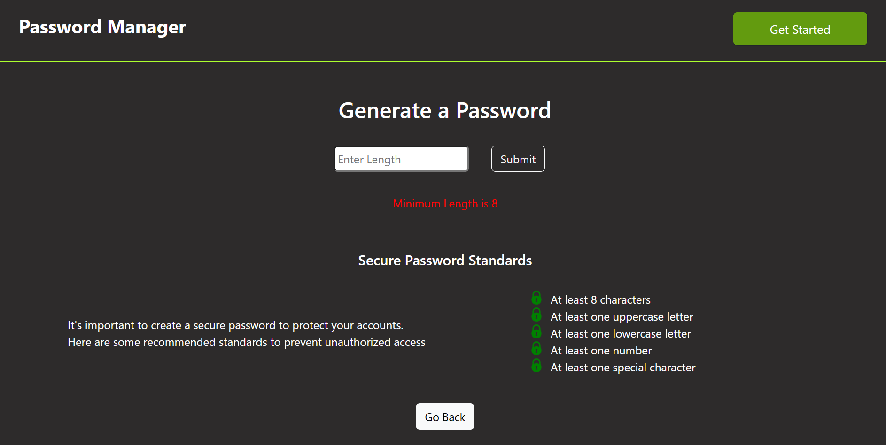
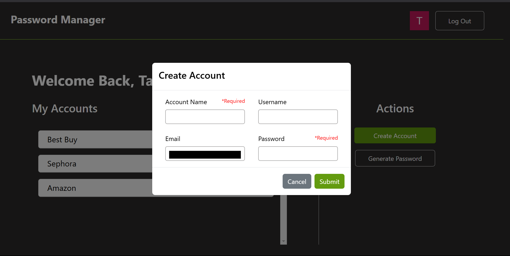

# password-manager
This application offers complete CRUD functionality to manage user password accounts. Sensitive data is encrypted and securely stored in the database, and decrypted for return upon receiving accurate user credentials. 

Additionally, users may generate strong, unique passwords of their desired length, with an 8 character minimum.

**Generate Password**

**Create Account**

### Tech Stack
- **Language:** Python
- **Backend Framework:** Flask
- **Frontend Framework:** React
- **Authentication:** Auth0
- **Database:** SQLAlchemy
- **Encryption:** Cryptography

### Installation
**In server directory:** 
`pip install -r requirements.txt`

**In root directory:**
`npm install`

### Run Application
`npm start`
